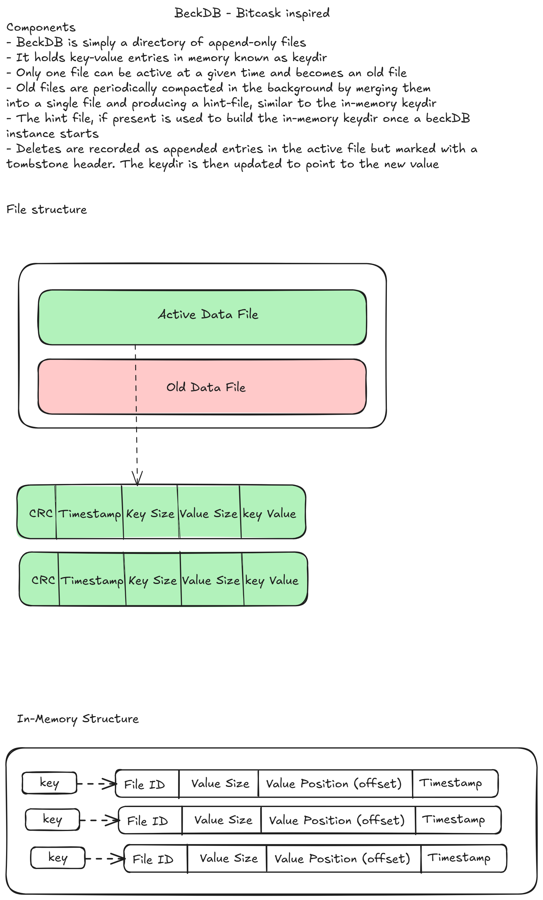

# BeckDB - Log Structured KV store

BeckDB is a bitcask-inspired non-relational database. It aims to provide low latency and high throughput read/writes by leveraging an in-memory key-value store and an append-only file for durability.

## Usage

Using BeckDB is simple and straightforward as shown below

```go
// configuration with 64mb max file size. you can disable `syncOnWrite` for better write performance at the expense of strong durability
db, err := beck.Open(&beck.Config{
    DataDir: "./data",
    MaxFileSize: 64 * 1024 * 1024,
    SyncOnWrite: true,
})
if err != nil {
    log.Fatal(err)
}
defer db.Close()

// put and get operations
err := db.Put("key", []byte("value"))
val, err := db.Get("key")
```

## Testing

Run the test suite by:

```bash
# run test
make test

# run benchmark test
make bench-memory
```

## Performance

Based on benchmarks run on my Intel machine with **1.60GHz CPU** and **8 goroutines**, averaged over five runs:

### Throughput (Operations per Second)

### Throughput (Operations per Second)

| Operation               | Throughput           | Latency (avg) |
| ----------------------- | -------------------- | ------------- |
| **Write (Put)**         | **~200,000 ops/sec** | 5 μs          |
| **Read (Get)**          | **~175,000 ops/sec** | 6 μs          |
| **Mixed (Put+Get)**     | **~95,000 ops/sec**  | 11 μs         |
| **Database Open/Close** | **~90 ops/sec**      | 12 ms         |

### Key Performance Characteristics

-   **High Write Throughput**: Up to 200K writes/second with minimal latency when `sync on write` is disabled
-   **Fast Reads**: 175K reads per second with consistent performance
-   **Fast Recovery**: Database startup averages 12ms. This includes rebuilding in-memory index from disk

## Considerations

-   The data and hints file are all kept in the data directory with extensions, `xx.log` and `xx.hint` respectively
-   Keys are stored as strings with values being stored as byte slice to allow for any value type.
-   The single-writer model is used here to avoid corruption of database
-   For better write performance, you can turn off `syncOnWrite` to allow background file persistence to disk. The default interval is 1 second

## Architecture



## TODO

-   [ ] Implement stale file compaction
-   [ ] Add database server

## References

-   Checkout the bitcask paper to know more about the underlying storage engine powering BeckDB
